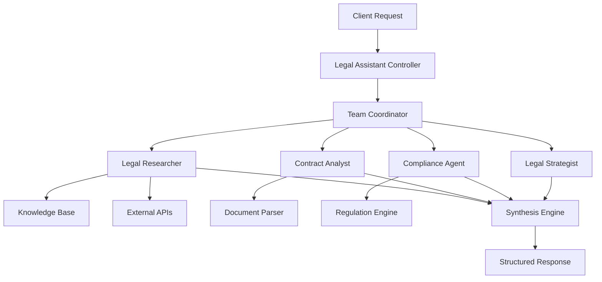

# ⚖️ Smart Legal Assistant

> **AI-Powered Legal Research & Analysis Platform**  
> Revolutionizing legal workflows through intelligent multi-agent coordination


<div align="center">
     <div>
    
    
    
  </div>
</div>

## 🚀 **Overview**

Smart Legal Assistant is a sophisticated AI-powered platform that transforms legal research and document analysis through intelligent multi-agent coordination. Built with enterprise-grade architecture, it delivers professional-quality legal insights comparable to traditional legal research workflows.

### 🎯 **Key Capabilities**

- **🤖 Multi-Agent AI System**: Specialized agents for contract analysis, compliance, research, and strategy
- **📄 Document Intelligence**: Advanced PDF/DOCX analysis with risk assessment
- **⚖️ Legal Research**: Automated precedent discovery and citation management
- **🛡️ Compliance Monitoring**: GDPR, CCPA, HIPAA violation detection

---

## 🏗️ **System Architecture**



### 🧠 **AI Agent Specializations**

| Agent | Specialization | Key Features |
|-------|---------------|--------------|
| **Legal Researcher** | Case law & precedents | Westlaw integration, citation formatting |
| **Contract Analyst** | Document review | Risk scoring, clause analysis |
| **Compliance Agent** | Regulatory compliance | GDPR/CCPA monitoring, violation alerts |
| **Legal Strategist** | Strategic planning | Cost analysis, timeline projections |
| **Team Coordinator** | Response synthesis | Context preservation, quality control |

---

## 🛠️ **Technology Stack**

### **Backend (Spring Boot)**
- **Framework**: Spring Boot 3.5.3 with Java 21
- **AI Engine**: LangChain4j with Groq LLaMA 3 integration
- **Data Processing**: Apache PDFBox, Apache POI
- **Database**: H2 (development)


#
---

## 🚀 **Quick Start**

### **Prerequisites**
```bash
- Java 21+
- Node.js 18+
- Maven 3.8+
- Groq API Key
```

### **Backend Setup**
```bash
# Clone repository
git clone https://github.com/yourusername/smart-legal-assistant.git
cd smart-legal-assistant

# Configure environment
export GROQ_API_KEY="your-groq-api-key"
export GROQ_MODEL_NAME="llama3-8b-8192"

# Run backend
mvn spring-boot:run
```

### **Frontend Setup**
```bash
# Navigate to frontend
cd frontend

# Install dependencies
npm install

# Start development server
npm run dev
```


